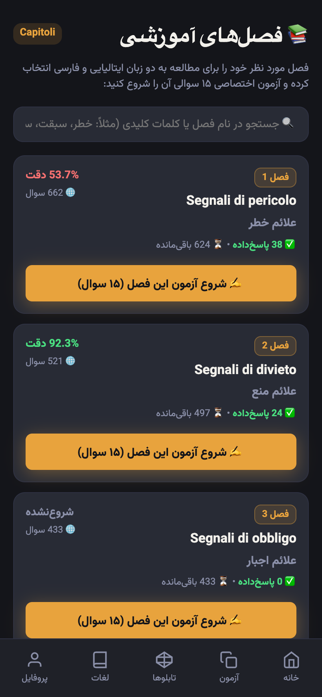
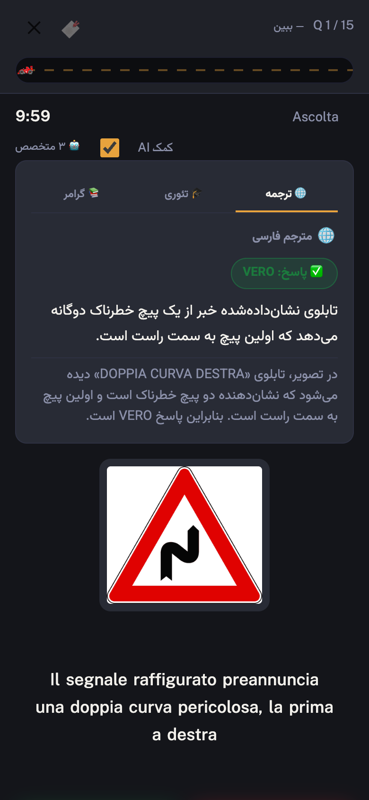
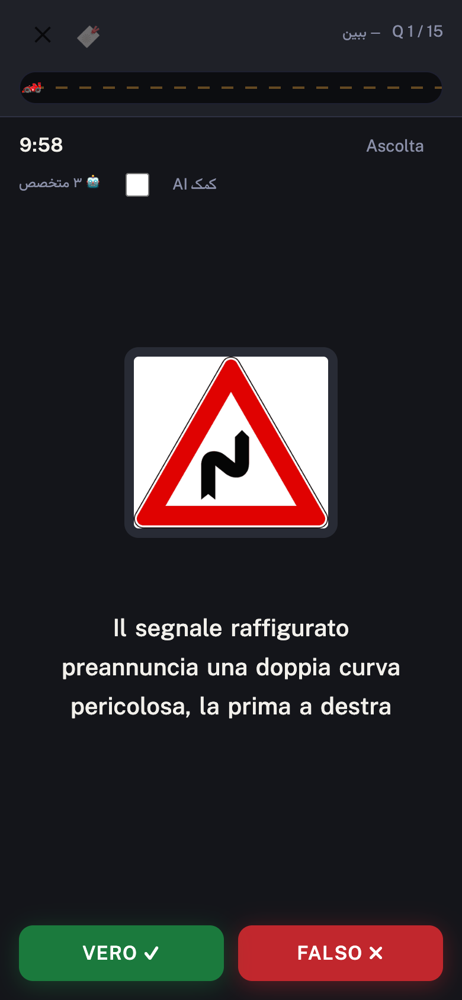

# PatenteFa 🇮🇹🇮🇷

> **Pass the Italian driving theory exam when Italian isn't your first language.**
> تمرین آزمون تئوری پاتنته ایتالیا — به فارسی

A Telegram bot + Mini App that teaches the Italian *patente B* theory exam to Persian
speakers. **7,139 official questions**, every one translated and explained in Persian by
an AI layer that is grounded in the database rather than trusted blind.

Runs entirely on one **Cloudflare Worker** — no servers, no containers, no separate
frontend host. In production with daily users.

**→ [patentefarsi.online](https://patentefarsi.online)**

<p align="center">
  
  
  
</p>

---

## What's interesting in here

**Authentication with no signup, no password, no email.**
Telegram signs a payload with the bot token; the Worker verifies it with an HMAC
(`src/lib/auth.ts`) and derives the user from the signature. There is no login screen —
the user is authenticated before the first frame renders.

**The AI is grounded in the database, not trusted.**
Vision models read road signs confidently and get them *backwards*: asked about sign 279
(arrow pointing right), GPT-4o answered "PASSAGGIO OBBLIGATORIO A SINISTRA" on three runs
out of three. A mirrored left/right doesn't just look wrong — it teaches the opposite
traffic rule. So the sign's verified name is read from a reviewed `sign_meanings` table
covering all 413 images and passed *into* the prompt. The model explains a named sign
instead of guessing which sign it is.

**Everything on the edge, one deploy.**
Hono routes, D1 for relational data, R2 for the 413 sign images, KV for nonces and rate
limiting, and cron triggers for the morning reminder and nightly backup. `npm run deploy`
ships the API, the Mini App, and the static assets together.

**Spaced repetition built on real mistakes.**
Wrong answers enter a review queue with an interval schedule; they come back when they're
*due*, not on every session, and the random fill skips anything seen in the last 14 days
so practice doesn't turn into recall of the same 30 questions.

**Trilingual, RTL-first UI.** Persian interface, Italian exam text, English/Italian
technical vocabulary — laid out RTL without a UI framework.

---

## Architecture

```
Telegram client
   ├── Bot chat  → Cloudflare Worker (Hono)
   │                  ├── /webhook/telegram   (bot updates)
   │                  ├── /api/*              (Mini App REST API, HMAC-authenticated)
   │                  └── /app                (Mini App HTML shell)
   └── Mini App (WebView) → same Worker

Cloudflare:
   D1    → 7,139 questions, sessions, answers, review queue, vocab, users
   R2    → 413 road-sign images, nightly backups
   KV    → rate limiting / nonce cache
   Cron  → 06:00 review reminder, 23:00 nightly backup
```

| | |
|---|---|
| **Runtime** | Cloudflare Workers |
| **Language** | TypeScript (strict) |
| **Routing** | Hono |
| **Data** | D1 (SQLite), R2, KV |
| **Frontend** | Vanilla JS + CSS, no framework, no build step |
| **AI** | OpenAI — `gpt-4o-mini` for text, `gpt-4o` for sign images |
| **Scale** | 7,139 questions · 3,983 with images · 25 chapters |

---

## ⚠️ Data Notice

The question bank is sourced from [`Ed0ardo/QuizPatenteB`](https://github.com/Ed0ardo/QuizPatenteB) (MIT), which was last updated in 2023.
**Spot-check against [ilportaledellautomobilista.it](https://www.ilportaledellautomobilista.it) before your exam date** for any questions that may have changed.

---

## Setup

### Prerequisites

- [Node.js](https://nodejs.org) ≥ 18
- A [Cloudflare account](https://dash.cloudflare.com/sign-up) (free tier is sufficient)
- A Telegram bot created via [@BotFather](https://t.me/BotFather)

### 1. Install dependencies

```bash
npm install
```

### 2. Login to Cloudflare

```bash
npx wrangler login
```

### 3. Create Cloudflare resources

```bash
# D1 database
npx wrangler d1 create patente-fa-db
# → Copy the database_id into wrangler.jsonc

# KV namespace
npx wrangler kv namespace create patente-fa-kv
# → Copy the id into wrangler.jsonc

# R2 bucket (for road-sign images and backups)
npx wrangler r2 bucket create patente-fa-signs
```

Update `wrangler.jsonc` with the IDs you get from the above commands.

### 4. Configure secrets

Copy `.dev.vars.example` to `.dev.vars` and fill in your values:

```bash
cp .dev.vars.example .dev.vars
```

| Variable | Where to get it |
|---|---|
| `TELEGRAM_BOT_TOKEN` | @BotFather → `/newbot` |
| `TELEGRAM_WEBHOOK_SECRET` | Any random string (e.g. `openssl rand -hex 32`) |
| `OPENAI_API_KEY` | [platform.openai.com/api-keys](https://platform.openai.com/api-keys) |
| `OPENAI_MODEL` | Recommended: `gpt-4o-mini` |
| `OPENAI_VISION_MODEL` | Optional. Used only for questions with a sign/diagram image, where `gpt-4o-mini` misreads the picture. Default: `gpt-4o` |
| `ALLOWED_TELEGRAM_USER_IDS` | Your numeric Telegram ID (get it from @userinfobot) |
| `LOG_CHANNEL_ID` | Create a private channel, add the bot as admin, get the channel ID |
| `MINI_APP_URL` | Your deployed Worker URL (see step 7) |
| `DEFAULT_TIMEZONE` | `Europe/Rome` |

### 5. Apply the database schema

```bash
npm run db:migrate:local
```

### 6. Import the question bank

```bash
npm run import
# Then apply the generated SQL:
npx wrangler d1 execute patente-fa-db --local --file data/insert_topics.sql
npx wrangler d1 execute patente-fa-db --local --file data/insert_questions.sql
```

### 7. Deploy

```bash
npm run deploy
```

Copy the deployed Worker URL and set it as `MINI_APP_URL` in your `.dev.vars` and as a Cloudflare secret:

```bash
npx wrangler secret put MINI_APP_URL
# (paste the URL when prompted)
```

Apply the production secrets:

```bash
npx wrangler secret put TELEGRAM_BOT_TOKEN
npx wrangler secret put TELEGRAM_WEBHOOK_SECRET
npx wrangler secret put OPENAI_API_KEY
npx wrangler secret put OPENAI_MODEL
npx wrangler secret put ALLOWED_TELEGRAM_USER_IDS
npx wrangler secret put LOG_CHANNEL_ID
```

Apply schema to production:

```bash
npm run db:migrate:remote
npx wrangler d1 execute patente-fa-db --remote --file data/insert_topics.sql
npx wrangler d1 execute patente-fa-db --remote --file data/insert_questions.sql
```

### 8. Register the Telegram webhook

```bash
curl -X POST "https://api.telegram.org/bot<YOUR_BOT_TOKEN>/setWebhook" \
  -H "Content-Type: application/json" \
  -d '{
    "url": "https://<YOUR_WORKER>.workers.dev/webhook/telegram",
    "secret_token": "<YOUR_WEBHOOK_SECRET>",
    "allowed_updates": ["message", "callback_query"]
  }'
```

### 9. Set the Mini App button in BotFather

In BotFather: `/mybots` → your bot → `Bot Settings` → `Menu Button` → enter your Worker URL.

---

## Local development

```bash
npm run dev
```

For cron testing:

```bash
npx wrangler dev --test-scheduled
# Then visit http://localhost:8787/__scheduled?cron=0+6+*+*+*
```

---

## Tests

```bash
npx tsc --noEmit                       # strict type check
npx tsx scripts/test-sign-grounding.ts # sign-image URL resolution + AI grounding
npx tsx scripts/test-srs.ts            # spaced-repetition scheduling
npx tsx scripts/test-trial.ts          # free-trial window
```

---

## Bot commands

| Command | Action |
|---|---|
| `/start` | Register + open Mini App |
| `/oggi` | Start a new 30-question simulation |
| `/review` | Start review mode for pending mistakes |
| `/vocab` | Open vocabulary list |
| `/stats` | Quick stats summary |

---

## Pass rule (real Italian exam)

**30 statements, 20 minutes, ≤ 3 wrong answers = pass.**
A 4th wrong answer is a fail. This app enforces the same rule.

---

## License

**All rights reserved.** This code is public so it can be read and evaluated —
not reused. It is not open source, and no permission is granted to deploy it or
build a product from it. See [LICENSE](LICENSE).

The setup instructions above exist so the project can be understood and verified,
not as an invitation to run a copy of it.
